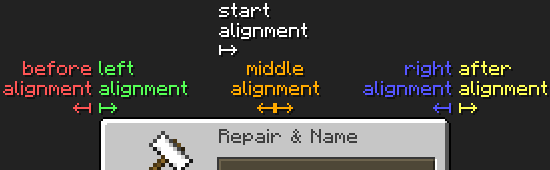
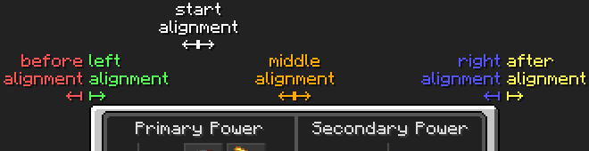
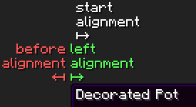
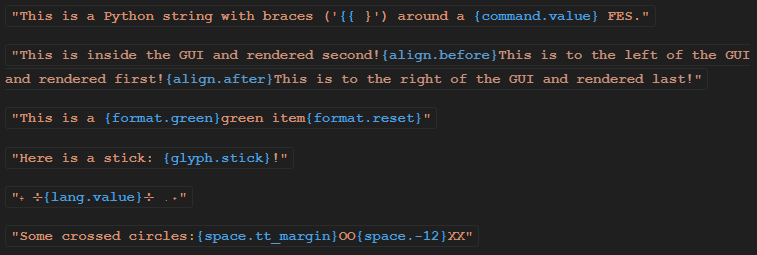

# Minecraft Lang Generator

This set of scripts is designed to aid in the creation of formatted item names, inventory titles, and other lang strings. Included features are alignment anchors, named formatting codes and spacings, custom glyph support, and original lang placeholder for automatic generation of every language in the game.

---

<details>
<summary>TOC</summary>

> 1. [Bugs](#bugs)
> 2. [Abbreviations](#abbreviations)
> 3. [Setup](#setup)
> 4. [Operation](#operation)
>    1. [Configuration](#configuration)
>    2. [Preparation](#preparation)
>    3. [Lang Generation](#lang-generation)
>    4. [Cleanup](#cleanup)
> 5. [Lang Formatting](#lang-formatting)
>    1. [Alignment](#alignment)
>    2. [Formatting Codes](#formatting-codes)
>    3. [Custom Glyphs](#custom-glyphs)
>    4. [Lang Placeholder](#lang-placeholder)
>    5. [Spacing](#spacing)
> 6. [ResPackOpts](#respackopts)
> 7. [Additional Notes](#additional-notes)
</details>

---

## Bugs

[MC-278459 unifont.json contains trailing comma](https://bugs.mojang.com/browse/MC-278459) will prevent lang generation, since Python's JSON parser is not lenient towards syntax errors, while the game's parser is. After obtaining the files in the [Preparation](#preparation) step, `unifont.json` must be manually updated to fix this bug by removing the stray comma on line 100 (The bug reports line 101, even though the images show line 100). This bug has been fixed as of game version 25w18a (fourth snapshot release for game version 1.21.6, released Apr 29, 2025).

## Abbreviations

- __FES__: Format Escape Sequence
- __LFS__: Lang Format String

## Setup

Python 3 and the following non-builtin modules are required to run the scripts:

- numpy (`pip install numpy`)
- PIL (`pip install Pillow`)

To download the scripts, navigate to the root directory of an extracted copy of the target resource pack and run `git clone https://github.com/voltavidTony/lang-gen.git`. Make sure the following files and folders are present and in the correct locations (Note that any files not used by the lang generator are omitted from the file tree for brevity).

```
<resource pack root folder>/
├ assets/
│ └ minecraft/
│   ├ font/
│   │ └ default.json
│   ├ lang/
│   └ textures/
│     └ font/
│       └ empty.png (256 x 256 completely empty PNG)
└ lang-gen/
  ├ characters.py
  ├ config.py
  ├ file_tasks.py
  └ gen_langs.py
```

> __Note:__ The lang generator works with any resource pack, as long as it defines the following set of `empty` glyphs in `assets/minecraft/font/default.json`:
>
> <details>
> <summary>Minimum implementation of 'assets/minecraft/font/details.json'</summary>
>
> ```json
> {
>     "providers": [
>         {
>             "type": "bitmap",
>             "file": "minecraft:font/empty.png",
>             "ascent": -32768,
>             "height": -130,
>             "chars": [
>                 "\uf780"
>             ]
>         },
>         {
>             "type": "bitmap",
>             "file": "minecraft:font/empty.png",
>             "ascent": -32768,
>             "height": -66,
>             "chars": [
>                 "\uf7c0"
>             ]
>         },
>         {
>             "type": "bitmap",
>             "file": "minecraft:font/empty.png",
>             "ascent": -32768,
>             "height": -34,
>             "chars": [
>                 "\uf7e0"
>             ]
>         },
>         {
>             "type": "bitmap",
>             "file": "minecraft:font/empty.png",
>             "ascent": -32768,
>             "height": -18,
>             "chars": [
>                 "\uf7f0"
>             ]
>         },
>         {
>             "type": "bitmap",
>             "file": "minecraft:font/empty.png",
>             "ascent": -32768,
>             "height": -10,
>             "chars": [
>                 "\uf7f8"
>             ]
>         },
>         {
>             "type": "bitmap",
>             "file": "minecraft:font/empty.png",
>             "ascent": -32768,
>             "height": -6,
>             "chars": [
>                 "\uf7fc"
>             ]
>         },
>         {
>             "type": "bitmap",
>             "file": "minecraft:font/empty.png",
>             "ascent": -32768,
>             "height": -4,
>             "chars": [
>                 "\uf7fe"
>             ]
>         },
>         {
>             "type": "bitmap",
>             "file": "minecraft:font/empty.png",
>             "ascent": -32768,
>             "height": -3,
>             "chars": [
>                 "\uf7ff"
>             ]
>         },
>         {
>             "type": "bitmap",
>             "file": "minecraft:font/empty.png",
>             "ascent": -32768,
>             "height": 0,
>             "chars": [
>                 "\uf801"
>             ]
>         },
>         {
>             "type": "bitmap",
>             "file": "minecraft:font/empty.png",
>             "ascent": -32768,
>             "height": 1,
>             "chars": [
>                 "\uf802"
>             ]
>         },
>         {
>             "type": "bitmap",
>             "file": "minecraft:font/empty.png",
>             "ascent": -32768,
>             "height": 3,
>             "chars": [
>                 "\uf804"
>             ]
>         },
>         {
>             "type": "bitmap",
>             "file": "minecraft:font/empty.png",
>             "ascent": -32768,
>             "height": 7,
>             "chars": [
>                 "\uf808"
>             ]
>         },
>         {
>             "type": "bitmap",
>             "file": "minecraft:font/empty.png",
>             "ascent": -32768,
>             "height": 15,
>             "chars": [
>                 "\uf810"
>             ]
>         },
>         {
>             "type": "bitmap",
>             "file": "minecraft:font/empty.png",
>             "ascent": -32768,
>             "height": 31,
>             "chars": [
>                 "\uf820"
>             ]
>         },
>         {
>             "type": "bitmap",
>             "file": "minecraft:font/empty.png",
>             "ascent": -32768,
>             "height": 63,
>             "chars": [
>                 "\uf840"
>             ]
>         },
>         {
>             "type": "bitmap",
>             "file": "minecraft:font/empty.png",
>             "ascent": -32768,
>             "height": 127,
>             "chars": [
>                 "\uf880"
>             ]
>         }
>     ]
> }
> ```
> </details>

## Operation

In total there are four steps taken in generating the LFS:

1. [Configuration](#configuration)
2. [Preparation](#preparation)
3. [Lang Generation](#lang-generation)
4. [Cleanup](#cleanup)

These steps are explained below:

### Configuration

All configuration is contained in `config.py`. Only this file needs to be modified when changing the LFS. The lang generator is pre-configured for the Redstone Tweaks resource pack by RexxStone and game version 1.21.4 installed via the official launcher.

> __Note:__ Only the top half of `config.py` should be edited. Everything below the "STOP" banner should remain unchaged to ensure correct operation of the lang generator.

The following steps describe the general process of configuring the lang generator:

1. Ensure all four paths are correct:

   - `assets` is the path to the assets folder in the game files, which contains the indexes, objects, and skins sub-folders
   - `index_file` is the file name of the index file to use for generation. This configuration exists to allow the generation of lang strings for older versions of the game, which may use a different set of lang keys
   - `mc_jar` is the path to the JAR file of the target game version
   - `rp_dest` is the filepath where the lang generator automatically re-compresses the extracted resource pack to. To prevent this, simply make `rp_dest` map to an empty string

   > __Note:__ `assets`, `mc_jar`, and `rp_dest` must be absolute paths, but can contain shell symbols such as the tilde (`~`) for the home directory or `%AppData%` if on Windows

2. If common amounts of space, measured in UI pixels, are used in the LFS, they can be added to `SPACE` as named values. This allows spacing values to be referenced by name instead of by value, allowing the positioning of multiple elements to be changed in one spot. Additionally, there are eight pre-defined spacing values seen towards the bottom of `config.py`, including the margins around the inventory and tooltip GUIs. These margins are defined by the `INV_MARGIN` and `TT_MARGIN` values in `config.py`, and can be edited to change the positions of the before- and after-aligned text segments (more about those in the [Alignment](#alignment) section)

3. If the target resource pack uses ResPackOpts, then an RPO file can be generated alongside each lang file by setting `GENERATE_RPO` to `True`. If only the lang files should be generated, set this value to `False`. Whether this feature is enabled does not affect the rules of the LFS contained in `LANG`.

4. `LANG` contains the LFS, which are used to build the lang strings that appear in-game. Each lang key maps to a string consisting of a series of text characters and FES, further explained in the [Lang Formatting](#lang-formatting) section. Special RPO rules apply to the lang keys, explained in the [ResPackOpts](#respackopts) section.

5. `KEY_VALUE_DEFAULTS_AND_FILTER` contains a mapping of filepaths to default values for those files. The filepaths can contain wildcards to create a definition for a type of file instead of a specific file, for instance all vanilla-compatible lang files. The values also act as a whitelist of values that persist across file generations to allow the removal of LFS from the lang files without requiring manual editing. In other words, only keys which are generated or specified in the defaults will appear in the new files. As such, a file not specified in the defaults will only contain generate values.

### Preparation

1. Ensure that the [Setup](#setup) requirements are met.
2. After configuration, some required files need to be imported so that the lang generator can calculate the character widths of each character. To import the necessary files, execute the `file_task.py` script.
3. Fix [MC-278459](https://bugs.mojang.com/browse/MC-278459), as described in the [Bugs](#bugs) section, if it still applies to the target game version.

### Lang Generation

Finally, the lang strings can be generated. Simply execute the `gen_langs.py` script. It generates the lang strings in three steps:

1. Load character map - The lang generator computes the width of each character supported by the game. If the resource pack contains `accented.png`, `ascii.png`, and/or `nonlatin_european.png`, it will use those instead of the vanilla versions. `ascii_sga.png` and `asciillager.png` are not used.
2. Pre-compute LFS - The lang generator processes the LFS as much as possible before the original lang values are inserted to reduce the amount of repeat computation for each language in the game
3. Lang generation - The original lang value is inserted into the LFS, and all of its sections are arranged and rendered into the final output, which is stored in the resulting lang files. This step also generates the RPO files if enabled

Step 2 also serves to validate the LFS and point out any errors encountered. This ensures that only valid LFSs make it into step 3 which generates the files. The error messages point out what error has occurred in which LFS, making it easy to locate it in the configuration.

### Cleanup

Cleanup is performed through the following two Git commands:
- `git clean -fd` will remove the files imported in the [Preparation](#preparation) step
- `git checkout .` will remove any changes made to the scripts

## Lang Formatting

The main appeal of the lang generator is the comprehensive formatting system. With it, custom lang content can be defined without having to consider character codes, pixel counts, or even which titles are centered or left-aligned. This is achieved through FES, which are treated like variables inserted via string interpolation, a feature available in many programming languages (an example of this is Python's F-strings). They are designed to improve the readablility of the LFS and separate the character placement from the lang string design. Specifically, custom glyphs, spacing, and the game's formatting codes are now referenced by name instead of hardcoded as unicode character codes. When writing an LFS, don't actually make it an F-string, it should be a regular string.

FES are comprised of a command word and a value word, joined by a period (`.`) and surrounded by braces (`{ }`). To have an opening brace outside of a FES, use a double opening brace (`{{`). Nested FES are not permitted.

Python syntax highlighters should display these FES in a different color as a regular string. Visual Studio Code with the Python extension pack displays them like this: <str>"This is a Python string with braces ('<fmt>{{</fmt> }') around a <fmt>{command.value}</fmt> FES."</str>

FES are comprised of the surrounding braces, lowercase letters a-z, underscores, and the joining period. The only exception is spacing values, which can be signed or unsigned integers. The following RegEx can be used to match a FES: `{([a-z]+)\.([a-z_]+|[+-]?[0-9]+)}` - capture group 1 is the command, capture group 2 the value. Generally, a regex shouldn't be used when generating langs as it will ignore malformed FES instead of throwing an error like a proper parser.

There are five total FES commands:

1. [align](#alignment)
2. [format](#formatting-codes)
3. [glyph](#custom-glyphs)
4. [lang](#lang-placeholder)
5. [space](#spacing)

### Alignment

The alignment FES are used to segment the LFS and align each of the text segments into one of a few relative positions. The current alignment takes effect until the next alignment FES is encountered. Further, multiple alignment FES with the same value can be specified to create overlapping text segments. This can be used, for instance, to create text inside of a graphic. They can also appear in any order, but keep in mind that the segments are sorted in order of their alignment, meaning that text styling via formatting codes may not produce the expected results. The sorting order is found in the `ALIGNMENTS` constant. Text segments can be further shifted by absolute amounts by adding leading or trailing spaces, which is further explained in the [Spacing](#spacing) section.

Alignment is achieved via six total anchor points, which describe a location and text direction. Five of the anchors are virtual ('before', 'left', 'middle', 'right', and 'after' alignments), meaning they do not exist in the game and are included soley for designing the LFS. They are always distributed across the container inventory GUI in the same way regardless of where the game places the text. The sixth anchor point ('start' alignment) is the game's actual anchor point when rendering text, and is thus the default alignment FES. It always matches how the game renders the text, so it will represent either left- or center-justified text depending on which text it is for. The six anchor points are:

| `anchor` | Effect |
| - | - |
| `.before` | Right-justified text appearing before the left edge of the GUI |
| `.left` | Left-justified text appearing at the left edge of the GUI |
| `.start` | Text appearing in the same way as the game's default text (default) |
| `.middle` | Center-justified text appearing in the center of the GUI |
| `.right` | Right-justified text appearing at the right edge of the GUI |
| `.after` | Left-justified text appearing after the right edge of the GUI |

> __Note:__ Since tooltips adjust their size to fit their content, 'middle', 'right', and 'after' alignments are disallowed when building LFS for them. This is because those anchor points require knowing the GUI's width in advance, which is not possible for dynamically sized GUI elements.

The following image shows the anvil as an example. The five virtual anchors are placed relative to the GUI texture, with 'before' and 'after' distanced from the edges of the GUI by four UI pixels. This gap can be increased or decreased as desired by changing the `INV_MARGIN` value in `config.py`. As seen in the image, the 'start' anchor is positioned to match the default title text, which is left-justified text at an offset of 60 UI pixels from the left edge.



The next image shows the beacon as an example of a GUI that is wider than usual and has two titles. This example shows how the five virtual anchor points adapt to the width of the GUI texture, meaning that an LFS using these alignments will produce consistent results across multiple inventory titles. The "Primary Power" and "Secondary Power" titles are two separate lang strings, but only the anchor points for the first are shown. Note that the 'start' anchor point now uses center-justification. (Yes, the vertical line in the GUI is off-center by one UI pixel, you're welcome.)



The final image shows the anchor points for a tooltip title. Since tooltips are variable width, only 'before', 'left', and 'start' are valid anchor points and thus the others are not shown. Again, the 'before' anchor is distanced from the GUI by four UI pixels, but this time it can be configured with the `TT_MARGIN` value in `config.py`.



> __Note:__ The virtual anchors are aligned to the GUI edges and are thus not meant for generating generic strings which exist on their own. In the chat, for instance, the 'left' and 'before' anchor points will cause parts of the text to appear off-screen or overlap with previous text.

__Example:__ <str>"This is inside the GUI and rendered second!<fmt>{align.before}</fmt>This is to the left of the GUI and rendered first!<fmt>{align.after}</fmt>This is to the right of the GUI and rendered last!"</str>

### Formatting Codes

This FES is provided for convenience, allowing the game's formatting codes to be specified by name. That is, neither the section symbol (`§`) nor the letter that comes after need to be typed or remembered. The list of formatting code names can be found near the bottom of `config.py`.

__Example:__ <str>"This is a <fmt>{format.green}</fmt>green item<fmt>{format.reset}</fmt>"</str>

### Custom Glyphs

Custom glyphs are defined by `assets/minecraft/font/default.json` and referenced in the LFS by their filename (without extension) instead of their character code. This allows the image to be modified, resized, redefined with a different character code, or even completely replaced without having to change the LFS (as long as the file name is the same). The lang strings only need to be regenerated for any alignment changes to take effect. The glyph PNG must be present at the defined location since the lang generator needs to read the image width.

> __Note:__ The empty glyphs defined in the [Setup](#setup) section cannot be referenced by the glyph FES. To create spaces between text elements, use a [Spacing FES](#spacing) instead.

__Example:__ <str>"Here is a stick: <fmt>{glyph.stick}</fmt>!"</str>

### Lang Placeholder

This FES is used to insert one of two values using the game's existing localization:

1. The original lang value of the current language file with `.value`
2. The current lang unit (language designator) with `.unit` (for instance 'en_us')

The lang FES can appear anywhere and multiple times in the LFS.

__Example:__ <str>"₊ ⊹<fmt>{lang.value}</fmt>⊹ ࣪ ˖"</str> (item name decorated with sparkles)

### Spacing

Spacing is important when designing the arrangement of graphical text elements, for instance, the margins between areas of the GUI or to shift text within its segment. Spacing values are defined in `SPACE` and then referenced by name in the FES, and can be negative. In addition to the configurable margin values, there are three pre-defined spacing values seen at the bottom of `config.py` which are based on in-game GUI dimensions. Spacing FES also permit signed and unsigned integer values for one-off spacing values, forming the only exception to the only-english-letters rule.

Spacing values can be used to shift text segements around their anchors. Within a text segment (where relevant), leading space will shift the text segment positively (positive amount shifts right, negative amount shifts left) and trailing space will shift the text segment negatively (positive amount shifts left, negative amount shifts right). Left- and after-aligned segments are only affected by leading space, before- and right-aligned only by trailing space, and middle-aligned by both. Note that in middle-aligned segments, the amount by which text is shifted is half of the amount of space used.

Under the hood, leading and trailing spaces are stripped to eliminate leftover invisible characters and to calculate the text positions of only the visible characters. This also results in instances of overlapping spacing between two segments being combined, minimizing the overall amount of `empty` characters used.

__Example:__ <str>"Some crossed circles:<fmt>{space.tt_margin}</fmt>OO<fmt>{space.-12}</fmt>XX"</str> (the O's and X's are overlapping)

## ResPackOpts

ResPackOpts is a mod by JFronny enabling configurable resource packs. In the case of lang files, additional RPO files are provided alongside the vanilla-compatible lang files to enable advanced features such as choosing different versions of a lang string or dynamically generated values.

The support for RPO files changes the format of the lang keys in the `LANG` configuration by introducing two new rules:

1. The lang key can start with an exclusion modifier which limits the generated lang to only be stored in one of the two generated files. The plus (`+`) restricts the generated lang to only the RPO-compatible lang file, the minus (`-`) to only the vanilla-compatible lang file. This can be used in combination with the 2nd rule to specify variants of the same lang string.

   > __Hint:__ Which exclusion modifier does what can be remembered like this: ResPackOpts _adds_ QoL features to resource packs, which is definitely a _plus_, since vanilla resource packs _lack_ configurability, which is a _minus_ for the game!

2. An optional RPO expansion can appear at the start of the lang key (ignoring the exclusion modifier). The RPO expansion will appear in the RPO-compatible lang file, but not the vanilla-compatible lang file, meaning that it can be used in a lang key that generates in both files. For instance, `"${chest_exp}container.chest": ...` will generate as `"${chest_exp}container.chest": ...` in the RPO-compatible lang file and `"container.chest": ...` in the vanilla-compatible lang file.

These two rules are the only parsing performed on the lang keys - any FES or RPO expansions in other positions will be copied verbatim. Furthermore, if the remainder of the lang key after removing the exclusion modifier and leading RPO expansion is not a lang key in the game's lang file, then the `{lang.value}` FES will contain a placeholder value. For instance, `"some.bad.lang.key": "It is a {lang.value}."` will generate as `"some.bad.lang.key": "It is a <?>."` in the output files.

To include RPO expansions in the LFS, simply escape the opening brace so that the lang generator doesn't try to parse it as a FES. Example: `"${{color_switch}..."`

> __Note:__ RPO expansions are not compatible with the vanilla game, and thus an alternative lang file must be supplied. For this reason, the lang generator creates up to three files for each language:
>
> 1. The vanilla-compatible lang file `assets/minecraft/lang/{lang.unit}.json`
> 2. The RPO-compatible lang file `assets/minecraft/lang_rpo/{lang.unit}.json`
> 3. The RPO expansions file `assets/minecraft/lang_rpo/{lang.unit}.json.rpo`
>
> In addition, it generates the RPO meta-file `assets/minecraft/lang/.rpo` which specifies to use the `lang_rpo` folder instead of the `lang` folder when RPO features are enabled

## Additional Notes

1. When making multiple incremental adjustments to the LFS, it could become tedious to wait for every language to generate. To only generate 'en_us.json', comment out the for loop found in `gen_langs.py` at lines 389-391.
2. The index file version cannot be automatically determined since different launchers choose the index file in different ways. Thus, the `index_file` mapping in `PATH` exists.
3. The lang generator currently requires the presence of the `assets/minecraft/lang` and `assets/minecraft/lang_rpo` folders, which must be created manually.
4. `characters.py` includes information about character widths and a character width calculator. Simply run the script and a prompt will appear. Any text typed into the prompt will produce a number indicating the width of the entered text in pixels. Any unicode character can be specified using hex escape sequences, such as `\x__`, `\u____`, and `\U________`.
5. GitHub removes and HTML and CSS tags and styling, so the example strings won't have proper color. An external MD viewer, like Visual Studio Code is required to see the colors. Here's what the examples are supposed to look like: 

<style>
  str {
    background-color: #1f1f1f;
    border-radius: 3px;
    border: 1px solid #2b2b2b;
    color: #ce9178;
    font-family: monospace;
    font-weight: bold;
    padding: 2px 5px;
  }
  fmt {
    color: #569cd6;
  }
</style>
