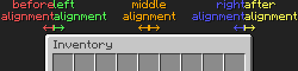

# Minecraft Lang Generator

This set of scripts is designed to aid in the creation of formatted item names, inventory titles, and other lang strings. Included features are alignment anchors, named formatting codes and spacings, custom glyph support, and original lang placeholder for automatic generation of every language in the game.

---

<details>
<summary>TOC</summary>

> 1. [Bugs](#bugs)
> 2. [Abbreviations](#abbreviations)
> 3. [Setup](#setup)
> 4. [Operation](#operation)
>    1. [Configuration](#configuration)
>    2. [Preparation](#preparation)
>    3. [Lang Generation](#lang-generation)
>    4. [Cleanup](#cleanup)
> 5. [Lang Formatting](#lang-formatting)
>    1. [Alignment](#alignment)
>    2. [Formatting Codes](#formatting-codes)
>    3. [Custom Glyphs](#custom-glyphs)
>    4. [Lang Placeholder](#lang-placeholder)
>    5. [Spacing](#spacing)
> 6. [Additional Notes](#additional-notes)
</details>

---

## Bugs

[MC-278459 unifont.json contains trailing comma](https://bugs.mojang.com/browse/MC-278459) will prevent lang generation, since Python's JSON parser is not lenient towards syntax errors, while the game's parser is. After obtaining the files in the [preparation](#preparation) step, `unifont.json` must be manually updated to fix this bug by removing the stray comma on line 100 (The bug reports line 101, even though the images show line 100). Since this bug does not manifest in the game, and since the GNU unifont itself is unlikely to receive an update, it is unclear if this bug will be fixed in the future.

## Abbreviations

- __FES__: Format Escape Sequence
- __LFS__: Lang Format String

## Setup

Python 3 and the following non-builtin modules are required to run the scripts:

- numpy (`pip install numpy`)
- PIL (`pip install Pillow`)
- requests (`pip install requests`)

To download the scripts, navigate to the root directory of an extracted copy of the target resource pack and run `git clone https://github.com/voltavidTony/lang-gen.git`. Make sure the following files and folders are present and in the correct locations (Note that any files not used by the lang generator are omitted from the file tree for brevity).

```
<resource pack root folder>/
├ assets/
│ └ minecraft/
│   ├ font/
│   │ └ default.json
│   ├ lang/
│   └ textures/
│     └ font/
│       └ empty.png (256 x 256 completely empty PNG)
└ lang-gen/
  ├ characters.py
  ├ config.py
  ├ file_tasks.py
  └ gen_langs.py
```

> __Note:__ The lang generator works with any resource pack, as long as it defines the following set of `empty` glyphs in `assets/minecraft/font/default.json`:
>
> <details>
> <summary>Minimum implementation of 'assets/minecraft/font/details.json'</summary>
>
> ```json
> {
>     "providers": [
>         {
>             "type": "bitmap",
>             "file": "minecraft:font/empty.png",
>             "ascent": -32768,
>             "height": -130,
>             "chars": [
>                 "\uf780"
>             ]
>         },
>         {
>             "type": "bitmap",
>             "file": "minecraft:font/empty.png",
>             "ascent": -32768,
>             "height": -66,
>             "chars": [
>                 "\uf7c0"
>             ]
>         },
>         {
>             "type": "bitmap",
>             "file": "minecraft:font/empty.png",
>             "ascent": -32768,
>             "height": -34,
>             "chars": [
>                 "\uf7e0"
>             ]
>         },
>         {
>             "type": "bitmap",
>             "file": "minecraft:font/empty.png",
>             "ascent": -32768,
>             "height": -18,
>             "chars": [
>                 "\uf7f0"
>             ]
>         },
>         {
>             "type": "bitmap",
>             "file": "minecraft:font/empty.png",
>             "ascent": -32768,
>             "height": -10,
>             "chars": [
>                 "\uf7f8"
>             ]
>         },
>         {
>             "type": "bitmap",
>             "file": "minecraft:font/empty.png",
>             "ascent": -32768,
>             "height": -6,
>             "chars": [
>                 "\uf7fc"
>             ]
>         },
>         {
>             "type": "bitmap",
>             "file": "minecraft:font/empty.png",
>             "ascent": -32768,
>             "height": -4,
>             "chars": [
>                 "\uf7fe"
>             ]
>         },
>         {
>             "type": "bitmap",
>             "file": "minecraft:font/empty.png",
>             "ascent": -32768,
>             "height": -3,
>             "chars": [
>                 "\uf7ff"
>             ]
>         },
>         {
>             "type": "bitmap",
>             "file": "minecraft:font/empty.png",
>             "ascent": -32768,
>             "height": 0,
>             "chars": [
>                 "\uf801"
>             ]
>         },
>         {
>             "type": "bitmap",
>             "file": "minecraft:font/empty.png",
>             "ascent": -32768,
>             "height": 1,
>             "chars": [
>                 "\uf802"
>             ]
>         },
>         {
>             "type": "bitmap",
>             "file": "minecraft:font/empty.png",
>             "ascent": -32768,
>             "height": 3,
>             "chars": [
>                 "\uf804"
>             ]
>         },
>         {
>             "type": "bitmap",
>             "file": "minecraft:font/empty.png",
>             "ascent": -32768,
>             "height": 7,
>             "chars": [
>                 "\uf808"
>             ]
>         },
>         {
>             "type": "bitmap",
>             "file": "minecraft:font/empty.png",
>             "ascent": -32768,
>             "height": 15,
>             "chars": [
>                 "\uf810"
>             ]
>         },
>         {
>             "type": "bitmap",
>             "file": "minecraft:font/empty.png",
>             "ascent": -32768,
>             "height": 31,
>             "chars": [
>                 "\uf820"
>             ]
>         },
>         {
>             "type": "bitmap",
>             "file": "minecraft:font/empty.png",
>             "ascent": -32768,
>             "height": 63,
>             "chars": [
>                 "\uf840"
>             ]
>         },
>         {
>             "type": "bitmap",
>             "file": "minecraft:font/empty.png",
>             "ascent": -32768,
>             "height": 127,
>             "chars": [
>                 "\uf880"
>             ]
>         }
>     ]
> }
> ```
> </details>

## Operation

In total there are four steps taken in generating the LFS:

1. [Configuration](#configuration)
2. [Preparation](#preparation)
3. [Lang Generation](#lang-generation)
4. [Cleanup](#cleanup)

These steps are explained below:

### Configuration

All configuration is contained in `config.py`. Only this file needs to be modified when changing the LFS. The lang generator is pre-configured for the Redstone Tweaks resource pack by RexxStone and game version 1.21.4.

> __Note:__ Only the top half of `config.py` should be edited. Everything below the "STOP" banner should remain unchaged to ensure correct operation of the lang generator.

The following steps describe the general process of configuring the lang generator:

1. Ensure all three paths are correct:

    - `assets` is the path to the assets folder in the game files, which contains the indexes, objects, and skins sub-folders
    - `index_file` is the file name of the index file to use for generation. This configuration exists to allow the generation of lang strings for older versions of the game, which may use a different set of lang keys
    - `mc_jar` is the path to the JAR file of the target game version
    - `rp_dest` is the filepath where the lang generator automatically re-compresses the extracted resource pack to. To prevent this, simply make `rp_dest` map to an empty string

    > __Note:__ `assets`, `mc_jar`, and `rp_dest` must be absolute paths, but can contain shell symbols such as the tilde (`~`) for the home directory, or `%AppData%` if on Windows

2. Verify that `CENTERED_TITLES` is complete. This list contains the lang keys of each container inventory title that is drawn in the middle of its GUI. Individual keys do not need to be removed from this list for older versions of the game which did not have them.

    > __Note:__ The survival inventory, crafting table, anvil, and smithing table have left aligned titles at non-standard positions. Furthermore, the trading inventory and beacon have two center aligned titles at non-standard positions. None of these inventories are inherently supported by the lang generator, and their non-standard spacing must be manually adjusted for in the LFS. Therefore, none of these inventories appear in `CENTERED_TITLES`.

3. If common amounts of space, measured in GUI pixels, are used in the LFS, they can be added to `SPACE` as named values. This allows spacing values to be referenced by name instead of by value, allowing the positioning of multiple elements to be changed in one spot. For example, the pre-configured value of `'chart_margin': 4` is used to control the amount of space between the inventory GUI and custom images outside of it. Additionally, there are 8 pre-defined spacing values seen towards the bottom of `config.py`.

4. `LANG` contains the LFS, which are used to build the lang strings that appear in-game. Each lang key maps to a string consisting of a series of text characters and FES, further explained in the [Lang Formatting](#lang-formatting) section.

5. Lastly, if desired, a resource pack options file can be generated along with each lang file. Keep in mind that no processing is done on these files, so each one will have identical contents. The contents of the RPO file are defined in `RPO_CONTENT`. To prevent the generation of RPO files, do not remove `RPO_CONTENT` entirely, just remove its contents so that it still exists but is empty.

### Preparation

1. Ensure that the [Setup](#setup) requirements are met.
2. After configuration, some required files need to be imported so that the lang generator can calculate the character widths of each character. To import the necessary files, execute the `file_task.py` script.
3. Fix [MC-278459](https://bugs.mojang.com/browse/MC-278459), as described in the [Bugs](#bugs) section, if it still applies to the target game version.

### Lang Generation

Finally, the lang strings can be generated. Simply execute the `gen_langs.py` script. It generates the lang strings in three steps:

1. Load character map - The lang generator computes the width of each character supported by the game. If the resource pack contains `accented.png`, `ascii.png`, and/or `nonlatin_european.png`, it will use those instead of the vanilla versions. `ascii_sga.png` and `asciillager.png` are not used.
2. Pre-compute LFS - The lang generator processes the LFS as much as possible before the original lang values are inserted to reduce the amount of repeat computation for each language in the game
3. Lang generation - The original lang value is inserted into the LFS, and all of its sections are arranged and rendered into the final output, which is stored in the resulting lang files

Step 2 also serves to validate the LFS and point out any errors encountered. This ensures that only valid LFSs make it into step 3 which generates the files. The error messages point out what error has occurred in which LFS, making it easy to locate it in the configuration.

### Cleanup

Cleanup is performed by using features of Git, thus the commands listed in this section need to be executed from within the scripting folder. To remove any imported and modified files, issue `git checkout .` on the command line. This will reset the entire `lang-gen/` folder back to the state it was in when it was first downloaded. If you want to preserve any changes to the configurations, first issue `git add config.py`.

## Lang Formatting

The main appeal of the lang generator is the comprehensive formatting system. With it, custom lang content can be defined without having to consider character codes, pixel counts, or even which titles are centered or left-aligned. This is achieved through FES, which are treated like variables inserted via string interpolation, a feature available in many programming languages (an example of this is Python's F-strings). They are designed to improve the readablility of the LFS and separate the character placement from the lang string design. Specifically, custom glyphs, spacing, and the game's formatting codes are now referenced by name instead of hardcoded as unicode character codes. When writing an LFS, don't actually make it an F-string, it should be a regular string.

FES are comprised of a command word and a value word, joined by a period (`.`) and surrounded by braces (`{ }`). To have an opening brace outside of a FES, use a double opening brace (`{{`). Nested FES are not permitted.

Python syntax highlighters should display these FES in a different color as a regular string. Visual Studio Code with the Python extension pack displays them like this: <str>"This is a Python string with braces ('<fmt>{{</fmt> }') around a <fmt>{command.value}</fmt> FES."</str>

FES are comprised of the surrounding braces, lowercase letters a-z, underscores, and the joining period. The only exception is spacing values, which can be signed or unsigned integers. The following RegEx can be used to match a FES: `{([a-z]+)\.([a-z_]+|[+-]?[0-9]+)}` - capture group 1 is the command, capture group 2 the value. Generally, a regex shouldn't be used when generating langs as it will ignore malformed FES instead of throwing an error like a proper parser.

There are 5 total FES commands:

1. [align](#alignment)
2. [format](#formatting-codes)
3. [glyph](#custom-glyphs)
4. [lang](#lang-placeholder)
5. [space](#spacing)

### Alignment

The alignment FES are used to segment the LFS and arrange each of those into its proper position. The current alignment takes effect until the next alignment FES is encountered. Further, multiple alignment FES with the same value can be specified to create overlapping text segments. This can be used, for instance, to create text inside of a graphic.

There are a total of five alignments distributed across three anchor points as seen in the image below. Their position does not change no matter the actual position and alignment of the GUI text in-game.



> __Note:__ Middle, right, and after alignment should only be used for container inventory names, as they are based on the width of the container inventory GUI and will not yield proper results for item tooltips and other strings.

Before- and left-aligned segments are both aligned to where the game starts rendering left-aligned text, with 'before' ending and 'left' starting at the left anchor point. This anchor point is 8 pixels to the right of the inventory GUI's left edge (this is 1 pixel further than the edge of the inventory slots). Note that without spacing, before-aligned and left-aligned segments will visually touch. To move before-aligned segments out of the inventory GUI, insert space at the end, specifically `inv_margin` and any additional space desired (for item name tooltips in the inventory use `tt_margin`).

Right- and after-aligned segments behave just like the two described above, except at the oppposite end of the inventory GUI, with 'right' ending and 'after' beginning at the right anchor point. This anchor point is 8 pixels to the left of the inventory GUI's right edge (also 1 pixel further than the edge of the inventory slots). Again, text across both segments will visually touch without added spacing. After-aligned segments can be moved outside of the inventory GUI by inserting space at the beginning, like the space at the end of before-aligned segments.

Middle-aligned segments place text so that its center is aligned with the middle anchor point. This anchor point is in the center of the inventory GUI. Space inserted on either side of middle-aligned segments will move the text.

Shifting text segments is further explained in the [Spacing](#spacing) section.

Alignment values can appear multiple times and in any order, but keep in mind that the text segments are ordered from left to right, that is, first all before-aligned text is rendered, then all left-aligned text, and so on. Text styling via formatting code FES do not reset when the next segment is rendered, therefore it is recommended to build the LFS in-order, i.e. first before-aligned segments, then left-aligned segments, then middle-aligned segments, then right-aligned segments, and finally after-aligned segments.

The default alignment is 'left', except for container inventories with middle-aligned titles, in which case it is 'middle', meaning that a leading left-alignment (or middle-alignment for inventories with centered titles) FES can be omitted.

__Example:__ <str>"This is inside the GUI and rendered second!<fmt>{align.before}</fmt>This is to the left of the GUI and rendered first!<fmt>{align.after}</fmt>This is to the right of the GUI and rendered last!"</str>

### Formatting Codes

This FES is provided for convenience, allowing the game's formatting codes to be specified by name. That is, neither the section symbol (`§`) nor the letter that comes after need to be typed or remembered. The list of formatting code names can be found near the bottom of `config.py`.

__Example:__ <str>"This is a <fmt>{format.green}</fmt>green item<fmt>{format.reset}</fmt>"</str>

### Custom Glyphs

Custom glyphs are defined by `assets/minecraft/font/default.json` and referenced in the LFS by their filename (without extension) instead of their character code. This allows the image to be modified, resized, redefined with a different character code, or even completely replaced without having to change the LFS (as long as the file name is the same). The lang strings only need to be regenerated for any alignment changes to take effect. The glyph PNG must be present at the defined location since the lang generator needs to read the image width.

> __Note:__ The empty glyphs defined in the [Setup](#setup) section cannot be referenced by the glyph FES, to create spaces between text elements, use a [spacing FES](#spacing) instead.

__Example:__ <str>"Here is a stick: <fmt>{glyph.stick}</fmt>!"</str>

### Lang Placeholder

This FES is used to insert the original lang value of the current language file, which allows the game's existing localization to be used. The lang FES can appear anywhere and multiple times in the LFS.

__Example:__ <str>"₊ ⊹<fmt>{lang.value}</fmt>⊹ ࣪ ˖"</str> (item name decorated with sparkles)

### Spacing

Spacing is important when designing graphical text elements, for instance, a chart might have a certain margin between it and the inventory GUI, or to make up for the inset nature of before- and after-aligned segments. Spacing values are defined in `SPACE` and then referenced by name in the FES, and can be negative. Additionally, there are 8 pre-defined spacing values seen at the bottom of `config.py` which are based on in-game GUI dimensions. In addition to named values, spacing FES permit signed and unsigned integer values for one-off spacing values, forming an exception to the only-english-letters rule.

Spacing values can be used to shift text segements around their anchors. Within a text segment (where relevant), leading space will shift the text positively (positive amount shifts right, negative amount shifts left) and trailing space will shift the text negatively (positive amount shifts left, negative amount shifts right). Left- and after-aligned segments are only affected by leading space, before- and right-aligned only by trailing space, and middle-aligned by both. Note that in middle-aligned segments, the amount that text is shifted is half of the amount of space used.

Under the hood, leading and trailing spaces are stripped to eliminate leftover invisible characters and to calculate the text positions of only the visible characters. This also results in instances of overlapping spacing between two segments being combined, minimizing the overall amount of `empty` characters used.

__Example:__ <str>"Some crossed circles:<fmt>{space.tt_margin}</fmt>OO<fmt>{space.-12}</fmt>XX"</str> (the O's and X's are overlapping)

## Additional Notes

1. When making multiple incremental adjustments to the LFS, it could become tedious to wait for every language to generate. To only generate 'en_us.json', comment out the for loop found in `gen_langs.py` at lines 321-323.
2. The index file version cannot be automatically determined since different launchers choose the index file in different ways. Thus, the `index_file` mapping in `PATH` exists.
3. `characters.py` includes information about character widths and a character width calculator. Simply run the script and a prompt will appear. Any text typed into the prompt will produce a number indicating the width of the entered text in pixels. Any unicode character can be specified using hex escape sequences, such as `\x__`, `\u____`, and `\U________`.

<style>
  str {
    background-color: #1f1f1f;
    border-radius: 3px;
    border: 1px solid #2b2b2b;
    color: #ce9178;
    font-family: monospace;
    font-weight: bold;
    padding: 2px 5px;
  }
  fmt {
    color: #569cd6;
  }
</style>
